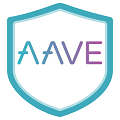
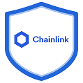

  

# _Welcome to the COOLEST Defi+NFT Hodling Pool!_

 

<a href="https://thegraph.com/" >

# Introduction
We introduce you to the __coolest community hodling pool__ on Ethereum- HodlTogether, which is a spicy amalgamation of the __Defi__, __NFTs__ and __NGOs__. HodlTogether uniquely incentivizes the users to Hodl their tokens which can be of any type such as LINK, ZRX, BAT, SRX, etc. for a long period of time. By doing so, they also contribute to the betterment of society and community development, as they donate a certain amount of their Hodled tokens to the NGO associated with the Hodling pool.

## Aim of the Project
The ongoing pandemic has certainly tested our resolve but it has also presented to us the world of cryptocurrencies. Number of people holding cryptocurrencies and digital assets has risen exponentially and the crypto community has benefitted from this rise as more of them want to explore the possibilities in this space. 

Many *amateur traders* who just started exploring this space buy tokens and sell it as soon as there is a small rise in the prices as there always remains this fear that the market may crash anytime (emotional trading). Due to this, they lose the opportunity to truly gain from holding their tokens long term. Also, the tokens sit idle in their wallets which can actually be put to better use when invested in different protocols and projects.

Our platform allows creation of pools by *anyone* wherein they can hold their tokens until a target price is reached (this is determined beforehand by the pool creator). Their idle assets collect interest using the Aave protocol. A *portion* of their earnings is given to __NGOs__ or charities vetted by the community or developers. The hodlers are __rewarded__ with __exciting NFTs__ created by these non-profit organisations.

## Incentivisation Method

When a person joins a pool, they are expected to hold their tokens until the target price of the pool is achieved. If they wish to withdraw their tokens before the target price is achieved, they can do so but a percentage of their withdrawal amount is given to the pool members and the NGOs. Upon achieving the target price of the pool, there is no withdrawal fee and the amount returned includes the interest accrued in Aave protocol. The hodlers are also eligible to receive NFTs created by partner NGOs. Distribution of NFTs can be done on a lottery basis or by leaderboard rankings. This simple theory discourages emotional trading and makes hodling exciting and rewarding.

## Pools

Each pool consists of a token type and a target price. Ex: A pool for LINK token or a pool for BAT token. There are two types of a pool:

1. __Public pools__

These types of pools are created by the developers and the target price is set ideally as the __all time high__ value of the token that pool represents. If the mood around the token price is bearish then developers can choose to set the price lower than the ATH as necessary. There is no barrier to entry in these types of pools. A __Unique thing__ about HodlTogether's Public pools is that it also awards __NFTs__ to the *top 5 Hodlers* of each Public pool. These NFTs are of __ERC-1155__ standard and are different for each type of token.

2. __Private pools__

These types of pools can be created by *anyone* and the target price can be set as desired beforehand. These pools can be made for any type of token that the user desires. To participate/join in these pools, one needs to have a private key/invitation which is only known to the pool creator. This key isn’t stored anywhere and is shown only once after the creation of the pool. This private key is only required once for verification purposes but otherwise, deposition and withdrawal of tokens can be done without this key.  

During deposition, each user is charged a minimal amount of fee equivalent to __1%__ of the total deposition amount. This fee amount is distributed equally amongst the NGOs that are associated with the platform. A user can withdraw his/her tokens from these pools anytime, but he will need to pay a __5%__ *withdrawal fee* that will be distributed among the NGOs and the pool members. A user can avoid this withdrawal fee entirely if he/she chooses to hodl his/her tokens in the pool until the pool breaks (target price is achieved) automatically. Thus, the users are *incentivized* to deposit and *hodl* their tokens together.

So, the private pools gives the users the ability to create a personal pool which they can share only with the people whom they want to invite. But unlike public pools, the private pools do not have the ERC-1155 token rewards for the top hodlers of the pool.  

## When does the pool break?
The public pools break i.e. get closed when the token in the pool reaches its all time high or when it reaches its week's highest price. In case of private pools, the creator of the pool himself sets the price point of when the pool should break. So he needs to be careful in choosing the right price when he thinks the pool should break as setting this value too high can result in the  pools never breaking. The token rewards are freely distributed amongst the participants without any withdrawal fee only after the pools breaks.

## Repositories
 Here are the github repo links for front-end and smart contracts of our project.
 - [Smart contracts](https://github.com/chainGers-2021/our-contracts)
 - [Front-end client](https://github.com/chainGers-2021/frontend-client)

# Demo Video

