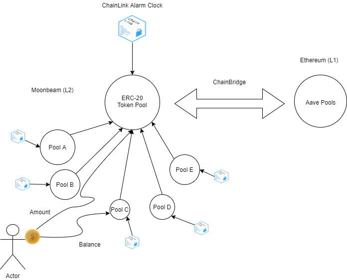

# HODLTogether
## Repositories
 Here are the github repo links for front-end and smart contracts of our project.
 - [Smart contracts](https://github.com/chainGers-2021/our-contracts)
 - [Front-end client](https://github.com/chainGers-2021/frontend-client)
## Concept
 - Any user can be a **pool admin** and create their own pool
 - These pools have certain **ERC20-Asset/USD** ATH breaking limits
 - People can invest their ERC20(in the backend we put all this **ERC20** into **AAVE Lending pool**)
 - When the specified **ERC20-Asset/USD** reaches the ATH(determined using **chainlink pricefeed**):
   - The pool **breaks**
   - Investors get their ERC20 asset with **some positive interest**  
 - One person at **random staker** will be awarded an **NFT**

## Work required
 - Depoying on Moonbeam
 - Using Chainlink price feeds, VRF
 - Shifting funds from Moonbeam to AAVE
 - ERC721 token issuance from our side to NGOs

## Structure

